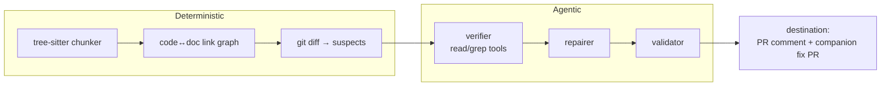

# DocPulse

> Docs that stay in sync with the heartbeat of the codebase.

DocPulse detects documentation sections invalidated by a pull request's code
changes and proposes surgical fixes via a companion PR. A deterministic layer
(tree-sitter chunking → code↔doc link graph → diff-driven suspect selection)
decides *what to check*; a bounded agentic layer (an LLM verifier with read/grep
tools, then a style-preserving repairer with a validation pass) decides *stale
or not, and how to fix it*.

## Quickstart (GitHub Action)

```yaml
# .github/workflows/docpulse.yml
name: DocPulse
on: pull_request
jobs:
  docpulse:
    runs-on: ubuntu-latest
    if: ${{ !startsWith(github.head_ref, 'docpulse/fix-') }}
    permissions:
      contents: write          # repair mode pushes a companion branch
      pull-requests: write
    steps:
      - uses: actions/checkout@v4
        with: { fetch-depth: 0 }
      - uses: YoniRaviv/DocPulse@v1
        with:
          mode: repair          # or "check" to comment-only
        env:
          ANTHROPIC_API_KEY: ${{ secrets.ANTHROPIC_API_KEY }}
          GH_TOKEN: ${{ secrets.GITHUB_TOKEN }}
          DOCPULSE_PR_NUMBER: ${{ github.event.pull_request.number }}
```

Add a `docpulse.yml` at your repo root (see [Configuration](#configuration)).

## Quickstart (CLI)

```bash
uv tool install docpulse                              # or: pipx install docpulse
docpulse index --root .                               # build the code<->docs link index
docpulse check  --base origin/main                    # verify docs vs the PR diff (exit 1 on drift)
docpulse check  --base origin/main --suspects-only    # keyless: list suspect sections only
docpulse repair --base origin/main                    # print proposed fixes + the dry-run PR plan
docpulse repair --base origin/main --write            # apply fixes to doc files locally (no push)
docpulse repair --base origin/main --push             # open the companion fix PR (needs gh + GH_TOKEN)
```

`check` exits 0 (clean), 1 (a doc section is stale at/above `flag_threshold`),
or 2 (setup/tool error). `unverified` never fails the build.

## Eval numbers

Measured on 12 hand-labeled seed cases (4 per language; 6 stale / 6 accurate)
with `anthropic/claude-haiku-4-5`:

| Metric    | Value |
|-----------|-------|
| Precision | 1.00  |
| Recall    | 1.00  |

The seed cases are deliberately clear-cut; robustness grows as real-world
false-positives are added back as cases. Run `docpulse eval --cases evals/cases`
to reproduce.

## Architecture



## Configuration

```yaml
model: anthropic/claude-sonnet-4-6        # any LiteLLM model string
embedding_model: openai/text-embedding-3-small
docs:
  - path: "docs/**/*.md"
  - path: "README.md"
code:
  include: ["src/**"]
  exclude: ["**/*.test.*", "tests/**"]
confidence:
  auto_fix_threshold: 0.85
  flag_threshold: 0.5
budget:
  max_suspects_per_run: 20
  max_tool_calls_per_suspect: 10
context: [git]
```

Secrets come only from env vars (`ANTHROPIC_API_KEY`, `OPENAI_API_KEY`, …).
`docpulse index --heuristics-only` builds the link graph without embeddings (no key).

## Jenkins / any CI

```bash
# The image entrypoint is env-driven (it always runs `index` then the chosen
# mode with --push). Configure it with -e vars, not CLI args:
docker run --rm \
  -e ANTHROPIC_API_KEY -e GH_TOKEN \
  -e DOCPULSE_MODE=check \
  -e DOCPULSE_BASE_REF=origin/main \
  -v "$PWD:/work" -w /work \
  ghcr.io/yoniraviv/docpulse:latest
```
